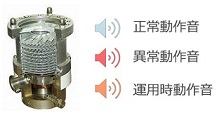

<html>
<head>
<meta charset="utf-8">
</head>

<body>
<h2>Oracle Advance Analytics ソリューション</h2>

<table width="80%" border="0" >
  <tbody>
    <tr>
      <td width="33%">

      <strong><u>工場IoT データを用いた装置の異常検知</u></strong> 
      
</td>
      <td width = "33%">

      <u><strong>フルーツの併売分析</strong></u> 
      
      
</td>
      <td width = "34%">

      <u><strong>保険顧客の購買予測</strong></u><strong></strong> 
      
      
</td>
    </tr>
    <tr>
      <td>

        <strong><u>顧客の不足情報を補足</u></strong>&nbsp; 
        準備中
        

      </td>
      <td>

          <strong><u>ビールの需要予測</u></strong>&nbsp; 
        準備中
      

      </td>
      <td>XXXXXXX&nbsp;</td>
    </tr>
  </tbody>
</table>

<h2>Oracleの高度な機械学習</h2>

※ 製品の概要については<a href="https://github.com/oracle4engineer/advanced-analytics/wiki" title="Oracleの高度な機械学習" target="_blank">こちら</a>から
   

　<strong>Oracle Business Analytics Japan</strong>

   
</body>
</html>
